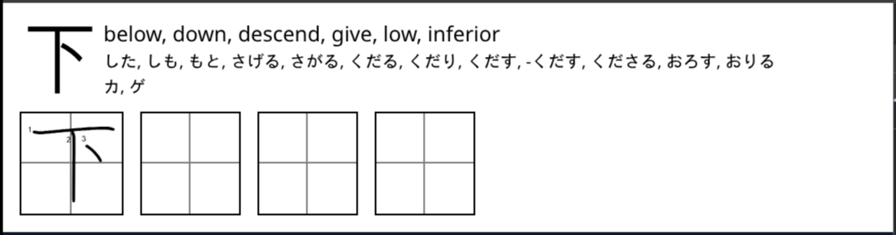
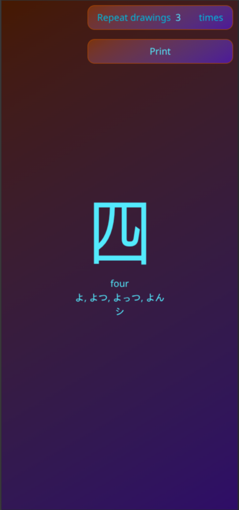
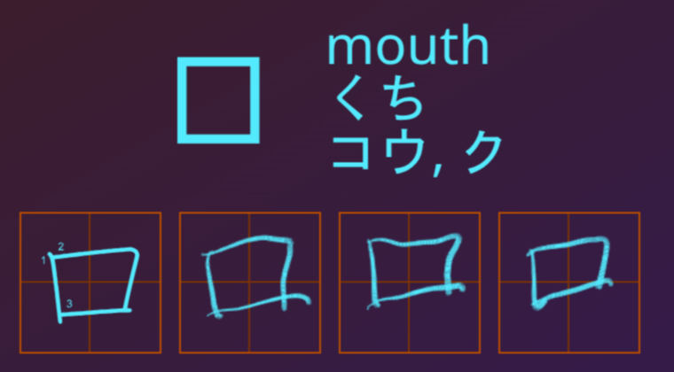
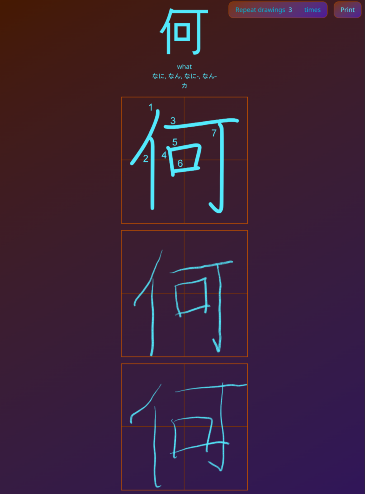

# marumori-kanji-printer
This simple web app shows a random kanji you already learned and let you print it with a thermal printer. 

## How to set up
1. Clone this repo
2. Open it in VS Code
3. Copy .env.example to .env and fill in your Marumori API key
4. Hit F5
5. Press Ctrl + P in Chromium to print

## Features
### Thermal printer support

### Web ui (also available as high contrast theme for e-ink screens)

#### …with stylus support
Just touch your screen with your pen to enable.

## Roadmap
- [x] Portrait mode
- [x] "App" UI
- [x] Stylus mode
- [x] E-Ink friendly high contrast theme
- [ ] PWA
- [ ] Support for large format printers
- [ ] Actual automation
